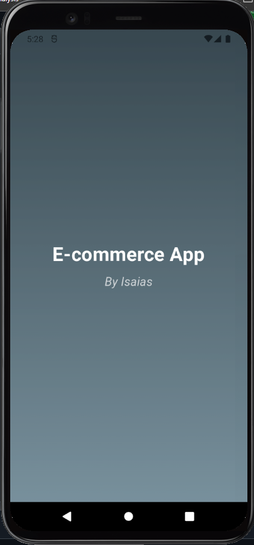
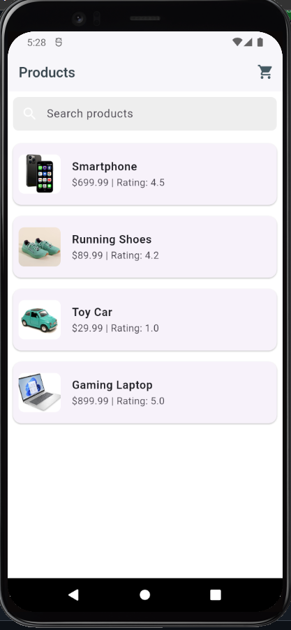
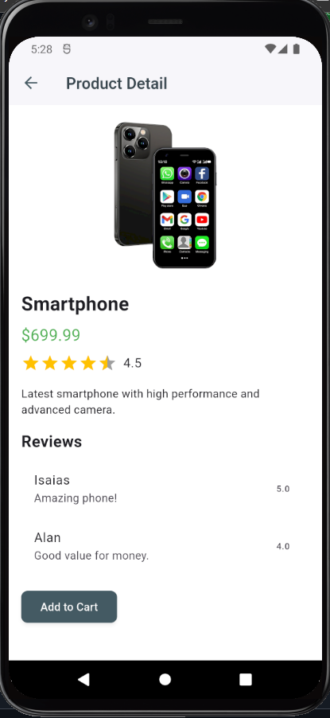
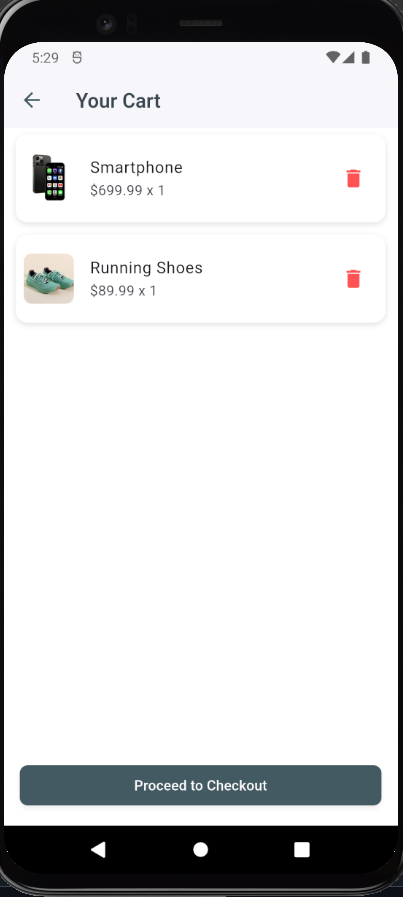
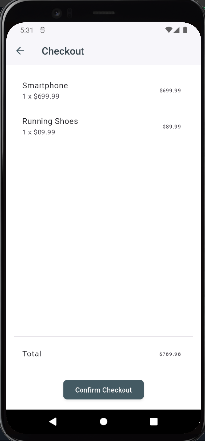

# E-Commerce App

A modern, stylish e-commerce application built with Flutter. The app demonstrates a Clean Architecture implementation using BLoC for state management and GoRouter for navigation. It features a sleek design with muted blue-grey tones, smooth animations, and soft shadows for a contemporary look.

## Main Features

- **Splash Screen:**  
  An animated splash page with a gradient background and fade‑in effect that displays "E-commerce App" and "By Isaias" before automatically navigating to the main product list.


- **Product Listings:**  
  Displays a list of products with:
  - High-quality images with rounded corners.
  - Product name, price, and rating.
  - Smooth animations and soft shadows on each card.
  - Tap on a product to view detailed information.


- **Product Detail Page:**  
  Provides detailed information for each product, including:
  - Large product image with fade‑in animation.
  - Product description and detailed pricing.
  - Customer reviews and ratings.
  - "Add to Cart" button with visual feedback.


- **Shopping Cart & Checkout:**  
  - A dedicated cart page that lists added products with their quantities.
  - Easy removal or update of items in the cart.
  - A checkout page that summarizes the cart items and total amount.
  - Confirmation feedback upon successful checkout.



## Architecture

The project is structured using **Clean Architecture**, which separates the app into three main layers:

- **Domain Layer:**  
  Contains core business logic and entities, such as `Product`, `Review`, and `CartItem`, as well as repository interfaces and use cases for actions like fetching products, searching, and managing the cart.

- **Data Layer:**  
  Implements the repository interfaces with simulated in‑memory data. It includes models that convert data to/from JSON if needed, and repository implementations for products and cart management.

- **Presentation Layer:**  
  Consists of Flutter pages, BLoC (for state management), and UI components.  
  - **BLoC:** Manages state for products and cart operations.  
  - **GoRouter:** Handles navigation between the splash, product list, product detail, cart, and checkout pages.

## Setup & Running the App

1. **Clone the Repository:**

   ```sh
   git clone https://github.com/your-username/vetpy.git
   cd vetpy
   ```

2. **Install Dependencies**
    ```sh
   flutter pub get
   ```

3. **Run app**
    ```sh
   flutter run
   ```

## Contact

### Author: Isaias Candia
### Email: isaias.candia.dev@gmail.com